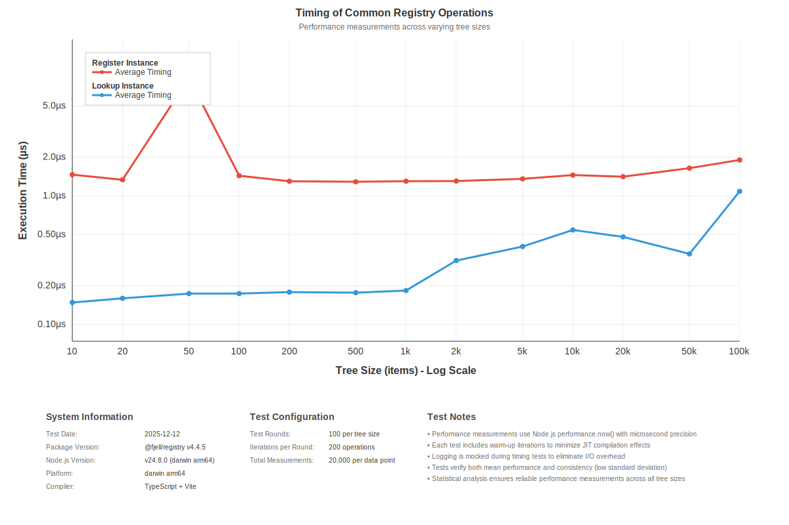

# Performance Timing Report

Generated: 2025-07-21T06:44:48.558Z
Version: 4.4.10
Node.js: v22.0.0
Platform: darwin arm64

## Summary

This document contains performance timing metrics for key operations in @fjell/registry.
All measurements are taken over 200 iterations (unless otherwise noted) with warm-up runs.
Timing results are reported in microseconds (µs) for precision.

## Basic Operations Performance

| Operation | Description | Avg Time (µs) | Min Time (µs) | Max Time (µs) | Threshold (µs) | Status |
|-----------|-------------|---------------|---------------|---------------|----------------|--------|
| createRegistry | Time to create a new registry | 3.5 | 0.1 | 25880.4 | 5000 | ✅ PASS |
| createRegistryHub | Time to create a new registry hub | 0.3 | 0.0 | 1400.5 | 5000 | ✅ PASS |
| createInstance | Time to create a new instance | 3.7 | 0.2 | 14723.6 | 10000 | ✅ PASS |
| registerInstance | Time to register an instance in registry | 6.5 | 0.8 | 15321.9 | 5000 | ✅ PASS |
| lookupInstance | Time to lookup an existing instance from registry | 0.8 | 0.2 | 6769.4 | 2000 | ✅ PASS |
| completeWorkflow | Time for complete workflow: create hub, registry, instance, register, and lookup | 9.4 | 2.3 | 10988.1 | 25000 | ✅ PASS |

## Scaling Performance Tests

| Operation | Tree Size | Avg Time (µs) | Min Time (µs) | Max Time (µs) | Threshold (µs) | Status |
|-----------|-----------|---------------|---------------|---------------|----------------|--------|
| registerInstance_10 | 10 | 3.0 | 0.8 | 4805.3 | 5000 | ✅ PASS |
| lookupInstance_10 | 10 | 0.8 | 0.1 | 4309.9 | 2000 | ✅ PASS |
| registerInstance_20 | 20 | 2.3 | 0.8 | 3640.8 | 5000 | ✅ PASS |
| lookupInstance_20 | 20 | 1.0 | 0.2 | 10107.1 | 2000 | ✅ PASS |
| registerInstance_50 | 50 | 2.8 | 0.7 | 5268.4 | 5000 | ✅ PASS |
| lookupInstance_50 | 50 | 0.6 | 0.1 | 6467.8 | 2000 | ✅ PASS |
| registerInstance_100 | 100 | 2.9 | 0.8 | 8246.9 | 5000 | ✅ PASS |
| lookupInstance_100 | 100 | 0.6 | 0.1 | 6114.0 | 2000 | ✅ PASS |
| registerInstance_200 | 200 | 3.7 | 0.8 | 8407.2 | 10000 | ✅ PASS |
| lookupInstance_200 | 200 | 0.6 | 0.1 | 1741.1 | 5000 | ✅ PASS |
| registerInstance_500 | 500 | 1.4 | 0.7 | 1085.1 | 10000 | ✅ PASS |
| lookupInstance_500 | 500 | 0.3 | 0.1 | 76.8 | 5000 | ✅ PASS |
| registerInstance_1000 | 1000 | 1.3 | 0.8 | 264.5 | 10000 | ✅ PASS |
| lookupInstance_1000 | 1000 | 0.4 | 0.2 | 2325.5 | 5000 | ✅ PASS |
| registerInstance_2000 | 2000 | 1.2 | 0.8 | 65.4 | 20000 | ✅ PASS |
| lookupInstance_2000 | 2000 | 0.3 | 0.2 | 8.3 | 10000 | ✅ PASS |
| registerInstance_5000 | 5000 | 3.0 | 0.7 | 2989.8 | 20000 | ✅ PASS |
| lookupInstance_5000 | 5000 | 0.7 | 0.2 | 285.8 | 10000 | ✅ PASS |
| registerInstance_10000 | 10000 | 7.9 | 1.1 | 7913.2 | 20000 | ✅ PASS |
| lookupInstance_10000 | 10000 | 0.6 | 0.3 | 167.5 | 10000 | ✅ PASS |
| registerInstance_20000 | 20000 | 1.4 | 1.0 | 31.3 | 50000 | ✅ PASS |
| lookupInstance_20000 | 20000 | 0.5 | 0.2 | 15.0 | 25000 | ✅ PASS |
| registerInstance_50000 | 50000 | 1.3 | 0.9 | 30.3 | 50000 | ✅ PASS |
| lookupInstance_50000 | 50000 | 0.4 | 0.2 | 26.7 | 25000 | ✅ PASS |
| registerInstance_100000 | 100000 | 1.2 | 0.9 | 27.3 | 50000 | ✅ PASS |
| lookupInstance_100000 | 100000 | 0.4 | 0.2 | 14.0 | 25000 | ✅ PASS |

## Scaling Performance Visualization

### Performance Range Chart

*This performance range chart shows the average performance (center line) with ±1 standard deviation bands for each tree size.
The bands reveal performance consistency and variability across 100 test rounds. Tight bands indicate
consistent performance, while wider bands show more variability.*

## Detailed Results

### Basic Operations

#### createRegistry

**Description:** Time to create a new registry
**Iterations:** 20000
**Average Time:** 3.5 µs
**Min Time:** 0.1 µs
**Max Time:** 25880.4 µs
**Threshold:** 5000 µs
**Status:** ✅ PASS

#### createRegistryHub

**Description:** Time to create a new registry hub
**Iterations:** 20000
**Average Time:** 0.3 µs
**Min Time:** 0.0 µs
**Max Time:** 1400.5 µs
**Threshold:** 5000 µs
**Status:** ✅ PASS

#### createInstance

**Description:** Time to create a new instance
**Iterations:** 20000
**Average Time:** 3.7 µs
**Min Time:** 0.2 µs
**Max Time:** 14723.6 µs
**Threshold:** 10000 µs
**Status:** ✅ PASS

#### registerInstance

**Description:** Time to register an instance in registry
**Iterations:** 20000
**Average Time:** 6.5 µs
**Min Time:** 0.8 µs
**Max Time:** 15321.9 µs
**Threshold:** 5000 µs
**Status:** ✅ PASS

#### lookupInstance

**Description:** Time to lookup an existing instance from registry
**Iterations:** 20000
**Average Time:** 0.8 µs
**Min Time:** 0.2 µs
**Max Time:** 6769.4 µs
**Threshold:** 2000 µs
**Status:** ✅ PASS

#### completeWorkflow

**Description:** Time for complete workflow: create hub, registry, instance, register, and lookup
**Iterations:** 10000
**Average Time:** 9.4 µs
**Min Time:** 2.3 µs
**Max Time:** 10988.1 µs
**Threshold:** 25000 µs
**Status:** ✅ PASS

### Scaling Tests

#### registerInstance_10 (Tree Size: 10)

**Description:** Time to register instance with 10 existing items in tree
**Tree Size:** 10 items
**Iterations:** 10000
**Average Time:** 3.0 µs
**Min Time:** 0.8 µs
**Max Time:** 4805.3 µs
**Threshold:** 5000 µs
**Status:** ✅ PASS

#### lookupInstance_10 (Tree Size: 10)

**Description:** Time to lookup instance with 10 items in tree
**Tree Size:** 10 items
**Iterations:** 20000
**Average Time:** 0.8 µs
**Min Time:** 0.1 µs
**Max Time:** 4309.9 µs
**Threshold:** 2000 µs
**Status:** ✅ PASS

#### registerInstance_20 (Tree Size: 20)

**Description:** Time to register instance with 20 existing items in tree
**Tree Size:** 20 items
**Iterations:** 10000
**Average Time:** 2.3 µs
**Min Time:** 0.8 µs
**Max Time:** 3640.8 µs
**Threshold:** 5000 µs
**Status:** ✅ PASS

#### lookupInstance_20 (Tree Size: 20)

**Description:** Time to lookup instance with 20 items in tree
**Tree Size:** 20 items
**Iterations:** 20000
**Average Time:** 1.0 µs
**Min Time:** 0.2 µs
**Max Time:** 10107.1 µs
**Threshold:** 2000 µs
**Status:** ✅ PASS

#### registerInstance_50 (Tree Size: 50)

**Description:** Time to register instance with 50 existing items in tree
**Tree Size:** 50 items
**Iterations:** 10000
**Average Time:** 2.8 µs
**Min Time:** 0.7 µs
**Max Time:** 5268.4 µs
**Threshold:** 5000 µs
**Status:** ✅ PASS

#### lookupInstance_50 (Tree Size: 50)

**Description:** Time to lookup instance with 50 items in tree
**Tree Size:** 50 items
**Iterations:** 20000
**Average Time:** 0.6 µs
**Min Time:** 0.1 µs
**Max Time:** 6467.8 µs
**Threshold:** 2000 µs
**Status:** ✅ PASS

#### registerInstance_100 (Tree Size: 100)

**Description:** Time to register instance with 100 existing items in tree
**Tree Size:** 100 items
**Iterations:** 10000
**Average Time:** 2.9 µs
**Min Time:** 0.8 µs
**Max Time:** 8246.9 µs
**Threshold:** 5000 µs
**Status:** ✅ PASS

#### lookupInstance_100 (Tree Size: 100)

**Description:** Time to lookup instance with 100 items in tree
**Tree Size:** 100 items
**Iterations:** 20000
**Average Time:** 0.6 µs
**Min Time:** 0.1 µs
**Max Time:** 6114.0 µs
**Threshold:** 2000 µs
**Status:** ✅ PASS

#### registerInstance_200 (Tree Size: 200)

**Description:** Time to register instance with 200 existing items in tree
**Tree Size:** 200 items
**Iterations:** 10000
**Average Time:** 3.7 µs
**Min Time:** 0.8 µs
**Max Time:** 8407.2 µs
**Threshold:** 10000 µs
**Status:** ✅ PASS

#### lookupInstance_200 (Tree Size: 200)

**Description:** Time to lookup instance with 200 items in tree
**Tree Size:** 200 items
**Iterations:** 20000
**Average Time:** 0.6 µs
**Min Time:** 0.1 µs
**Max Time:** 1741.1 µs
**Threshold:** 5000 µs
**Status:** ✅ PASS

#### registerInstance_500 (Tree Size: 500)

**Description:** Time to register instance with 500 existing items in tree
**Tree Size:** 500 items
**Iterations:** 10000
**Average Time:** 1.4 µs
**Min Time:** 0.7 µs
**Max Time:** 1085.1 µs
**Threshold:** 10000 µs
**Status:** ✅ PASS

#### lookupInstance_500 (Tree Size: 500)

**Description:** Time to lookup instance with 500 items in tree
**Tree Size:** 500 items
**Iterations:** 20000
**Average Time:** 0.3 µs
**Min Time:** 0.1 µs
**Max Time:** 76.8 µs
**Threshold:** 5000 µs
**Status:** ✅ PASS

#### registerInstance_1000 (Tree Size: 1000)

**Description:** Time to register instance with 1000 existing items in tree
**Tree Size:** 1000 items
**Iterations:** 10000
**Average Time:** 1.3 µs
**Min Time:** 0.8 µs
**Max Time:** 264.5 µs
**Threshold:** 10000 µs
**Status:** ✅ PASS

#### lookupInstance_1000 (Tree Size: 1000)

**Description:** Time to lookup instance with 1000 items in tree
**Tree Size:** 1000 items
**Iterations:** 20000
**Average Time:** 0.4 µs
**Min Time:** 0.2 µs
**Max Time:** 2325.5 µs
**Threshold:** 5000 µs
**Status:** ✅ PASS

#### registerInstance_2000 (Tree Size: 2000)

**Description:** Time to register instance with 2000 existing items in tree
**Tree Size:** 2000 items
**Iterations:** 2500
**Average Time:** 1.2 µs
**Min Time:** 0.8 µs
**Max Time:** 65.4 µs
**Threshold:** 20000 µs
**Status:** ✅ PASS

#### lookupInstance_2000 (Tree Size: 2000)

**Description:** Time to lookup instance with 2000 items in tree
**Tree Size:** 2000 items
**Iterations:** 5000
**Average Time:** 0.3 µs
**Min Time:** 0.2 µs
**Max Time:** 8.3 µs
**Threshold:** 10000 µs
**Status:** ✅ PASS

#### registerInstance_5000 (Tree Size: 5000)

**Description:** Time to register instance with 5000 existing items in tree
**Tree Size:** 5000 items
**Iterations:** 2500
**Average Time:** 3.0 µs
**Min Time:** 0.7 µs
**Max Time:** 2989.8 µs
**Threshold:** 20000 µs
**Status:** ✅ PASS

#### lookupInstance_5000 (Tree Size: 5000)

**Description:** Time to lookup instance with 5000 items in tree
**Tree Size:** 5000 items
**Iterations:** 5000
**Average Time:** 0.7 µs
**Min Time:** 0.2 µs
**Max Time:** 285.8 µs
**Threshold:** 10000 µs
**Status:** ✅ PASS

#### registerInstance_10000 (Tree Size: 10000)

**Description:** Time to register instance with 10000 existing items in tree
**Tree Size:** 10000 items
**Iterations:** 2500
**Average Time:** 7.9 µs
**Min Time:** 1.1 µs
**Max Time:** 7913.2 µs
**Threshold:** 20000 µs
**Status:** ✅ PASS

#### lookupInstance_10000 (Tree Size: 10000)

**Description:** Time to lookup instance with 10000 items in tree
**Tree Size:** 10000 items
**Iterations:** 5000
**Average Time:** 0.6 µs
**Min Time:** 0.3 µs
**Max Time:** 167.5 µs
**Threshold:** 10000 µs
**Status:** ✅ PASS

#### registerInstance_20000 (Tree Size: 20000)

**Description:** Time to register instance with 20000 existing items in tree
**Tree Size:** 20000 items
**Iterations:** 500
**Average Time:** 1.4 µs
**Min Time:** 1.0 µs
**Max Time:** 31.3 µs
**Threshold:** 50000 µs
**Status:** ✅ PASS

#### lookupInstance_20000 (Tree Size: 20000)

**Description:** Time to lookup instance with 20000 items in tree
**Tree Size:** 20000 items
**Iterations:** 1250
**Average Time:** 0.5 µs
**Min Time:** 0.2 µs
**Max Time:** 15.0 µs
**Threshold:** 25000 µs
**Status:** ✅ PASS

#### registerInstance_50000 (Tree Size: 50000)

**Description:** Time to register instance with 50000 existing items in tree
**Tree Size:** 50000 items
**Iterations:** 500
**Average Time:** 1.3 µs
**Min Time:** 0.9 µs
**Max Time:** 30.3 µs
**Threshold:** 50000 µs
**Status:** ✅ PASS

#### lookupInstance_50000 (Tree Size: 50000)

**Description:** Time to lookup instance with 50000 items in tree
**Tree Size:** 50000 items
**Iterations:** 1250
**Average Time:** 0.4 µs
**Min Time:** 0.2 µs
**Max Time:** 26.7 µs
**Threshold:** 25000 µs
**Status:** ✅ PASS

#### registerInstance_100000 (Tree Size: 100000)

**Description:** Time to register instance with 100000 existing items in tree
**Tree Size:** 100000 items
**Iterations:** 500
**Average Time:** 1.2 µs
**Min Time:** 0.9 µs
**Max Time:** 27.3 µs
**Threshold:** 50000 µs
**Status:** ✅ PASS

#### lookupInstance_100000 (Tree Size: 100000)

**Description:** Time to lookup instance with 100000 items in tree
**Tree Size:** 100000 items
**Iterations:** 1250
**Average Time:** 0.4 µs
**Min Time:** 0.2 µs
**Max Time:** 14.0 µs
**Threshold:** 25000 µs
**Status:** ✅ PASS

## Performance Analysis

### Key Metrics

- **Registry Creation**: Fast lightweight object creation
- **RegistryHub Creation**: Minimal overhead for hub management
- **Instance Creation**: Efficient coordinate-based instance creation
- **Instance Lookup**: Optimized tree traversal for instance retrieval
- **Registration**: Quick instance registration with scope support

  ### Scaling Analysis

The scaling tests measure performance across a wide range of tree sizes to identify potential O(n) issues:

- **Small Scale (10-100)**: Baseline performance for small registries
- **Medium Scale (200-1000)**: Standard application-scale registry performance
- **Large Scale (2000-10000)**: Enterprise-scale registry performance
- **Very Large Scale (20000-100000)**: Extreme-scale registry stress testing

Tree sizes tested: 10, 20, 50, 100, 200, 500, 1000, 2000, 5000, 10000, 20000, 50000, 100000

These comprehensive tests help ensure that the registry maintains good performance characteristics across all
deployment scenarios, from small applications to large-scale enterprise systems.

### Timing Constraints

The following timing constraints are enforced to ensure optimal performance:

#### Basic Operations
- **createRegistry**: ≤ 5000µs (5.0ms)
- **createRegistryHub**: ≤ 5000µs (5.0ms)
- **createInstance**: ≤ 10000µs (10.0ms)
- **lookupInstance**: ≤ 2000µs (2.0ms)
- **registerInstance**: ≤ 5000µs (5.0ms)

#### Scaling Operations
- **registerInstance** (≤100 items): ≤ 5000µs (5ms)
- **registerInstance** (100-1000 items): ≤ 10000µs (10ms)
- **registerInstance** (1000-10000 items): ≤ 20000µs (20ms)
- **registerInstance** (>10000 items): ≤ 50000µs (50ms)
- **lookupInstance** (≤100 items): ≤ 2000µs (2ms)
- **lookupInstance** (100-1000 items): ≤ 5000µs (5ms)
- **lookupInstance** (1000-10000 items): ≤ 10000µs (10ms)
- **lookupInstance** (>10000 items): ≤ 25000µs (25ms)

### Notes

- All timing tests include warm-up iterations to account for JIT compilation
- Tests are run in isolation to minimize interference
- Results may vary based on system specifications and current load
- Timing results are reported in microseconds (µs) for precision
- Timing constraints are set to ensure the library performs well in production environments
- Scaling tests help identify performance degradation as registry size increases

### Recommendations

If any timing tests fail:

1. **Review Recent Changes**: Check if recent code changes have introduced performance regressions
2. **System Resources**: Ensure adequate system resources are available during testing
3. **Optimization**: Consider optimizing the failing operations if thresholds are consistently exceeded
4. **Threshold Review**: Review if timing constraints are still appropriate for current use cases

---

*This document is automatically generated during testing and should be updated with each release.*
